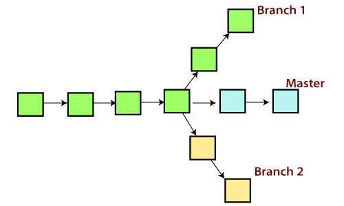

## What is Git

Git is a free, distributed version control system which allows programmers to keep track of code
changes, via "snapshots" (commits), in its current state. Utilizing commits allows programmers to
test, debug, and create new features collaboratively. All commits are kept in what is known as a
"Git Repository" that can be hosted on your computer, private servers, or open source websites,
such at Github.
Git also allows for users to create new "branches" of the code, which allows different versions of
the code to live alongside each other.

## Git has 3 different "areas" for your code:

• Working directory: The area that you will be doing all of your work in (creating, editing,
deleting, and organizing files)

• Staging area: The area where you will list the changes that you have made to the working
directory

• Repository: Where Git permanently stores the changes you have made as different
versions of the project

## Create your first repository, then add and commit files
At the command line, first verify that you have Git installed:
On all operating systems:

 **git --version**  

 On UNIX-like operating systems:
 
  **which git**
  
After installing Git, configure your username and email address as below . Do this before making a commit.
– git config --global user.name "Bugs Bunny"
– git config --global user.email bugs@gmail.com
Once Git is installed, navigate to the directory you want to place under version control and create
an empty Git repository:

**git init**

This creates a hidden folder, .git, which contains the plumbing needed for Git to work.
Next, check what files Git will add to your new repository; this step is worth special care:

**git status**

If all files in the list should be shared with everyone who has access to the repository, a single
command will add everything in your current directory and its subdirectories:

**git add .**

This will "stage" all files to be added to version control, preparing them to be committed in your
first commit.
For files that you want never under version control, create and populate a file named .gitignore
before running the add command.
Commit all the files that have been added, along with a commit message:

**git commit -m "Initial commit"**

To add a new remote, use the git remote add command on the terminal, in the directory your
repository is stored at.
The git remote add command takes two arguments:
1. A remote name, for example, **origin*
2. A remote URL, for example, **https://<your-git-service-address>/user/repo.git*
   
**git remote add origin https://<your-git-service-address>/owner/repository.git**

## Clone a repository

The git clone command is used to copy an existing Git repository from a server to the local
machine.
For example, to clone a GitHub project:
cd <path where you'd like the clone to create a directory>

**git clone https://github.com/username/projectname.git**

## Ignoring files and directories with a .gitignore file

how to avoid adding unwanted files (or file changes) in a Git repo. There are several ways
 (global or local .gitignore, .git/exclude) but keep in mind Git is managing content, which means: ignoring
actually ignores a folder content (i.e. files). An empty folder would be ignored by default, since it
cannot be added anyway.
You can make Git ignore certain files and directories — that is, exclude them from being tracked
by Git — by creating one or more **.gitignore files* in your repository.

When a file or directory is ignored, it will not be:

1. tracked by Git
2. reported by commands such as **git status* or **git diff*
3. staged with commands such as **git add -A*

Git keeps **"snapshots"** of the entire state of the project.
– Each checkin version of the overall code has a copy of
each file in it.
– Some files change on a given checkin, some do not.
– More redundancy, but faster.

In your local copy on git files can be
– In your local repo  (committed)

 Checked out and modified,
– but not yet committed (working copy)

In a "staging" area
– Staged files are ready to be committed.

**A commit saves a snapshot of all staged state.*

# Basic Git workflow

**Modify** files in your working directory.

**Stage** files, adding snapshots of them to your staging area.

**Commit** which takes the files in the staging area and stores that snapshot permanently to your Git directory.

**In Git** each user has their own copy of the repo, and commits changes to their local copy of the repo before pushing to the central server.
So Git generates a unique SHA-1 hash **(40 character string of hex digits)** for every commit.
– Refers to commits by this ID rather than a version number.

# Git Branch

A branch is a version of the repository that diverges from the main working project. It is a feature available in most modern version control systems. A Git project can have more than one branch. These branches are a pointer to a snapshot of your changes. When you want to add a new feature or fix a bug, you spawn a new branch to summarize your changes. So, it is complex to merge the unstable code with the main code base and also facilitates you to clean up your future history before merging with the main branch.

