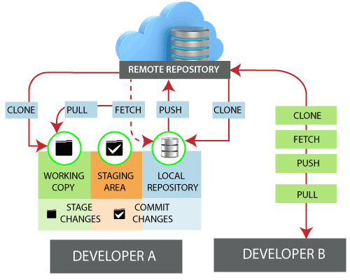
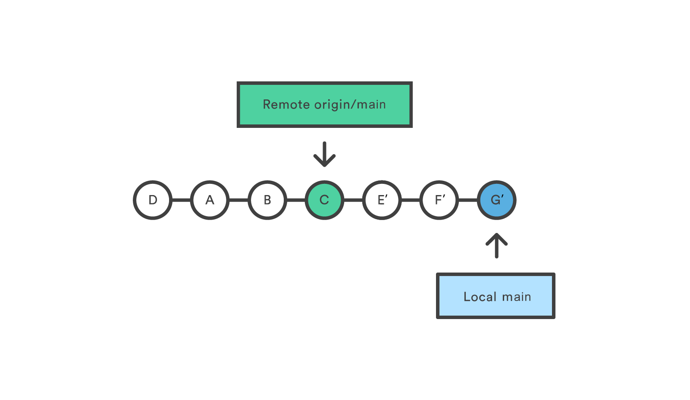

## Git Remote

In Git, the term remote is concerned with the remote repository. It is a shared repository that all team members use to exchange their changes. A remote repository is stored on a code hosting service like an internal server, GitHub, Subversion, and more. In the case of a local repository, a remote typically does not provide a file tree of the project's current state; as an alternative, it only consists of the .git versioning data.

The developers can perform many operations with the remote server. These operations can be a clone, fetch, push, pull, and more. Consider the below image:

## The benefits of  Git Remote:
• git remote  lets you create, view, and delete connections to other repositories.

• Remote connections are more like bookmarks rather than direct links into other repositories Instead of providing real-time access to another repository.

• by using  git remote we can use as convenient names that can be used to reference a not-so-convenient URL.

• Git remote  helps you to manage the set of repository whose branches you track.

• perform the sync operations required to keep the local repository updated as per the central repository and also to update the changes made by the developer in the local repository on the central repository

## To Check your Remote

To check the configuration of the remote server, run the git remote command. The git remote command allows accessing the connection between remote and local. If you want to see the original existence of your cloned repository, use the git remote command. It can be used as:

**git remote**

The given command is providing the remote name as the origin. **Origin** is the default name for the remote server, which is given by Git.
  
Git remote supports a specific option -v to show the URLs that Git has stored as a short name. These short names are used during the reading and write operation. Here, -v stands for verbose. We can use --verbose in place of -v. It is used as:

**git remote -v** 

The above output is providing available remote connections. If a repository contains more than one remote connection, this command will list them all.

**Git Remote Add** When we fetch a repository implicitly, git adds a remote for the repository. Also, we can explicitly add a remote for a repository. We can add a remote as a shot nickname or short name. To add remote as a short name, follow the below command:

**git remote add <short name><remote URL>**

To add a new remote, use the git remote add command on the terminal, in the directory your
repository is stored at.
The git remote add command takes two arguments:
1. A remote name, for example, **origin*
2. A remote URL, for example, **https://<your-git-service-address>/user/repo.git*
**git remote add origin https://<your-git-service-address>/owner/repository.git**

## Syncing (git remote)

**Git Fetch**

The git fetch command downloads commits, files, and refs from a remote repository into your local repo. Fetching is what you do when you want to see what everybody
When downloading content from a remote repo, git pull and git fetch commands are available to accomplish the task. You can consider git fetch the 'safe' version of the two commands. It will download the remote content but not update your local repo's it will download the remote content for the active local branch and immediately execute **git merge** to create a merge commit for the new remote content

**git fetch <remote>**

above command Fetch all of the branches from the repository. This also downloads all of the required commits and files from the other repository.

**git fetch <remote> <branch>**

Same as the above command, but only fetch the specified branch.

**git fetch --all**

A power move which fetches all registered remotes and their branches:

**Git push**

The git push command is used to upload local repository content to a remote repository. Pushing is how you transfer commits from your local repository to a remote repo. 

**git push <remote> <branch>**

Push the specified branch to , along with all of the necessary commits and internal objects. This creates a local branch in the destination repository. To prevent you from overwriting commits, Git won’t let you push when it results in a non-fast-forward merge in the destination repository.

**git push <remote> --force**

Same as the above command, but force the push even if it results in a non-fast-forward merge. Do not use the --force flag unless you’re absolutely sure you know what you’re doing.

Push all of your local branches to the specified remote.

**git push <remote> --tags**

Tags are not automatically pushed when you push a branch or use the --all option. The --tags flag sends all of your local tags to the remote repository.

**Git pull**

The git pull command is used to fetch and download content from a remote repository and immediately update the local repository to match that content. Merging remote upstream changes into your local repository is a common task in Git-based collaboration work flows. The git pull command is actually a combination of two other commands, git fetch followed by git merge.

**git pull <remote>**

Fetch the specified remote’s copy of the current branch and immediately merge it into the local copy. This is the same as git fetch ＜remote＞ followed by git merge origin/＜current-branch＞.

**git pull --no-commit <remote>**

Similar to the default invocation, fetches the remote content but does not create a new merge commit.

**git pull --rebase <remote>**

Same as the previous pull Instead of using git merge to integrate the remote branch with the local one, use git rebase.

**git pull --verbose**

Gives verbose output during a pull which displays the content being downloaded and the merge details.

## Git merge ##

**How it works**

Git merge will combine multiple sequences of commits into one unified history. In the most frequent use cases, git merge is used to combine two branches.  git merge takes two commit pointers, usually the branch tips, and will find a common base commit between them. Once Git finds a common base commit it will create a new "merge commit" that combines the changes of each queued merge commit sequence.

**Here's a basic usage example:**

**Make sure you are on the branch where you want to merge changes**

**git checkout <destination_branch>**

**Merge changes from another branch into the current branch**

**git merge <source_branch>**

For example, if you have a branch named feature_branch and you want to merge it into main, you would do the following:

**Switch to the main branch**

**git checkout main**

**Merge changes from the feature_branch into main**

**git merge feature_branch**

Git will automatically perform a merge and create a new commit that represents the combination of changes from both branches.

If there are conflicts between the branches ( changes in the same part of the same file) Git will notify you and you'll need to resolve those conflicts manually before completing the merge.

It's important to note that if you're working on a project with others, it's a good practice to regularly update your local branches with changes from the remote repository using git pull before attempting a merge, to ensure that you have the latest changes from other contributors.

Additionally, consider using the --no-ff (no fast-forward) option with git merge to preserve a more explicit branch history. This creates a merge commit even if Git could perform a fast-forward merge, making it clearer when and where branches were merged.

**git merge --no-ff <source_branch>**

Always be cautious when performing merges, especially on critical branches like main in a production environment. It's a good practice to review changes and possibly test them before merging to avoid introducing unexpected issues.

